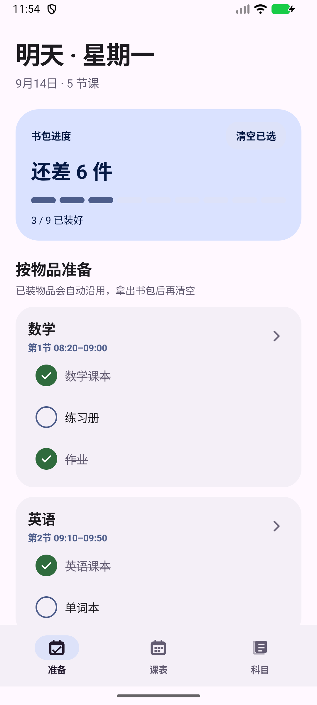
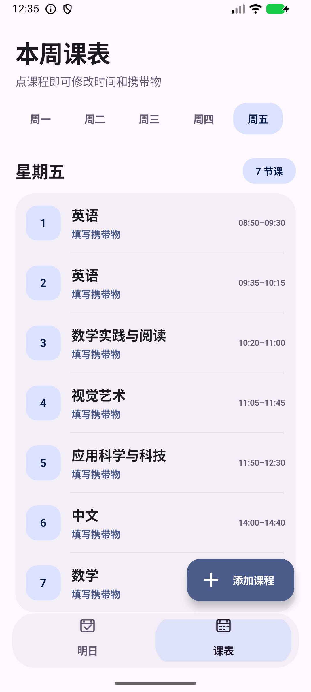
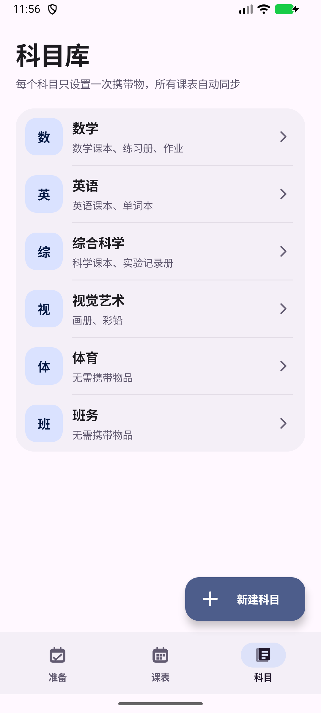
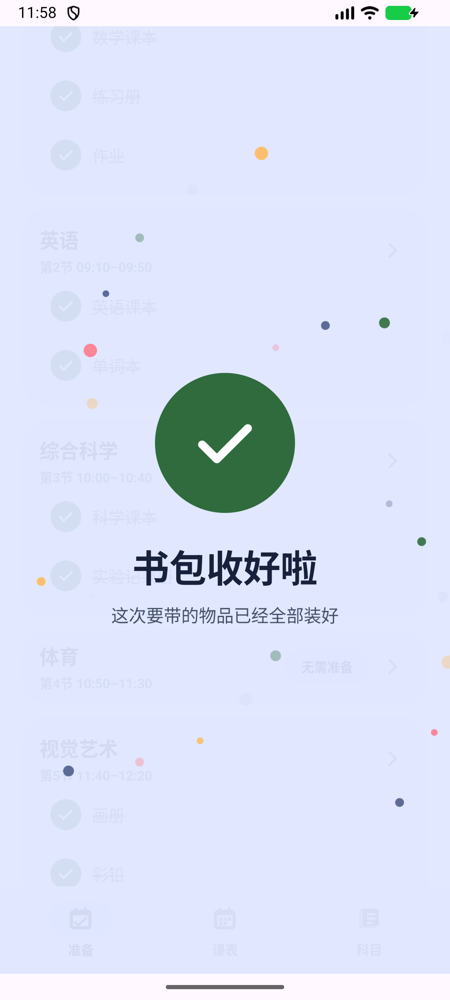

# 课程包

<p align="center">
  <strong>把课程表变成真正能逐件勾选的书包清单。</strong>
</p>

<p align="center">
  原生 Android · Material 3 Expressive · 完全离线 · 无广告
</p>

<p align="center">
  <strong>完整 APK 只有约 771 KiB（0.75 MiB）</strong>
</p>

课程包是一款轻量的学生课程表与书包整理应用。每个科目的课本、笔记、作业和用品只需设置一次，排入课表后，应用会自动生成当前需要准备的清单。

它没有账号系统、没有服务器、没有分析 SDK，也没有申请网络权限。不到 1 MiB 的安装包内已经包含课程表、科目库、逐件打卡、桌面小组件、深色模式、过渡动画、完成动效和震动反馈。

## 截图

<p align="center">
  
  
  
</p>

<p align="center">
  
</p>

## 为什么只有约 771 KiB

- 使用原生 Android View，不打包网页运行时。
- 不依赖广告、统计、账号或云服务 SDK。
- 图标和界面主要使用矢量资源与系统能力。
- 数据使用系统 `SharedPreferences` 保存在本机。
- 没有为了简单功能引入大型第三方框架。

小并不代表功能残缺：应用支持 Android 动态色、深色模式、Material 3 Expressive 层级、方向性页面动画、逐项完成反馈、桌面进度卡片以及后台跨日刷新。

## 功能

- **科目库**：先建立科目，再统一设置该科目需要携带的物品。
- **逐件勾选**：每一本书和每一件用品都有独立状态，不会整科一起完成。
- **书包状态沿用**：已经装入书包的物品会延续到之后的上课日，不必每天重复勾选。
- **安全清空**：提供“清空已选”，执行前必须二次确认，不会删除课程资料。
- **无需携带**：体育、班务等科目可以明确标记为无需准备物品。
- **智能准备日**：早上优先显示今天；18:00 后切换到下一个有课日，并跳过周末和无课日。
- **桌面小组件**：提供紧凑 2×2 与大号 4×2 两种独立布局。
- **待装摘要**：大号小组件直接显示空心勾选框和仍未装入的物品。
- **即时同步**：应用内勾选、编辑科目或修改课表后，小组件立即刷新。
- **后台更新**：跨日、时区变化、重启和应用升级后自动重新计算。
- **完成反馈**：最后一件物品完成时显示全屏庆祝动画、完成图标和震动。
- **完全离线**：不需要账号，没有广告，也不包含网络权限。
- **干净开始**：全新安装不附带示例课程，首次打开由用户建立自己的科目和课表。

## 基本流程

```text
建立科目和携带物 → 把科目排入每周课表 → 自动生成准备清单 → 逐件装包
```

## 桌面小组件

| 规格 | 显示内容 |
| --- | --- |
| 2×2 | 当前准备日、剩余数量、分段进度和完成状态 |
| 4×2 | 完整进度，以及最多三件尚未装入的物品 |

ColorOS 用户可通过以下路径添加：

```text
长按桌面空白处 → 卡片 → 全部卡片 → 插件 → 课程包
```

部分 ColorOS 版本不允许第三方小组件自由缩放，需要移除后重新选择另一种规格。

## 下载 APK

请前往仓库的 **Releases** 页面下载最新 APK：

**[下载最新版本](../../releases/latest)**

当前源码版本：**2.2.9（versionCode 21）**。

> 仓库只保存源码。APK 应作为 GitHub Release 附件发布，签名密钥不得提交到仓库。

## 从源码构建

### 环境

- JDK 17 或更高版本
- Android SDK 36
- Android Build Tools 36.x
- Android Gradle Plugin 8.10.1
- Android Studio，或兼容版本的 Gradle

使用 Android Studio 打开仓库根目录，等待 Gradle 同步后构建 `app` 模块即可。

```text
Build → Build APK(s)
```

项目没有远程服务或第三方账号依赖，编译后即可离线运行。

## 技术信息

| 项目 | 内容 |
| --- | --- |
| 开发语言 | Java |
| UI | 原生 Android View |
| 最低系统 | Android 8.0 / API 26 |
| 编译及目标 API | Android 36 |
| 数据存储 | SharedPreferences，仅保存在本机 |
| 网络权限 | 无 |
| APK 体积 | 789,469 bytes，约 771 KiB |

## 权限与隐私

| 权限 | 用途 |
| --- | --- |
| `VIBRATE` | 勾选与全部完成时提供触觉反馈 |
| `RECEIVE_BOOT_COMPLETED` | 重启后恢复小组件跨日更新 |

应用的 Manifest 没有声明 `INTERNET` 权限。科目、课表、携带物和书包状态都保存在本机；卸载应用时，Android 会一并删除这些数据。

## 参与贡献

欢迎提交 Issue 和 Pull Request。修改界面或功能时，请同时检查：

- 浅色与深色模式
- 窄屏与系统大字体
- Android 返回手势
- 系统关闭动画后的静态反馈
- 2×2 与 4×2 两种小组件
- 跨日和重启后的数据刷新

请勿提交签名密钥、个人课表、设备日志、ADB 截图或其他私人数据。

## 许可证

本项目使用 [Apache License 2.0](LICENSE)。

```text
SPDX-License-Identifier: Apache-2.0
```
