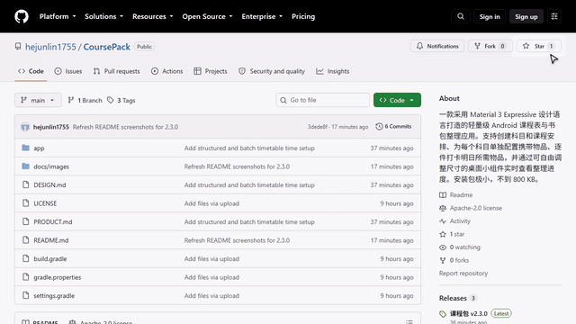
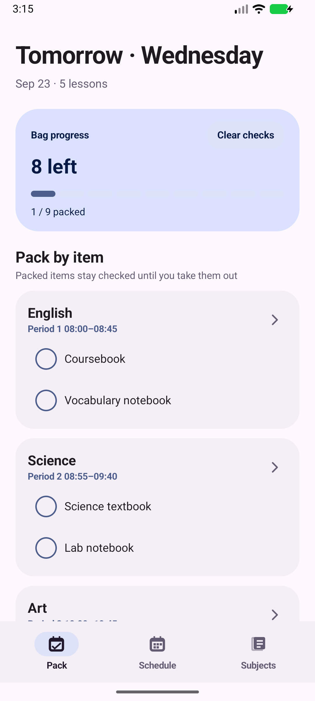
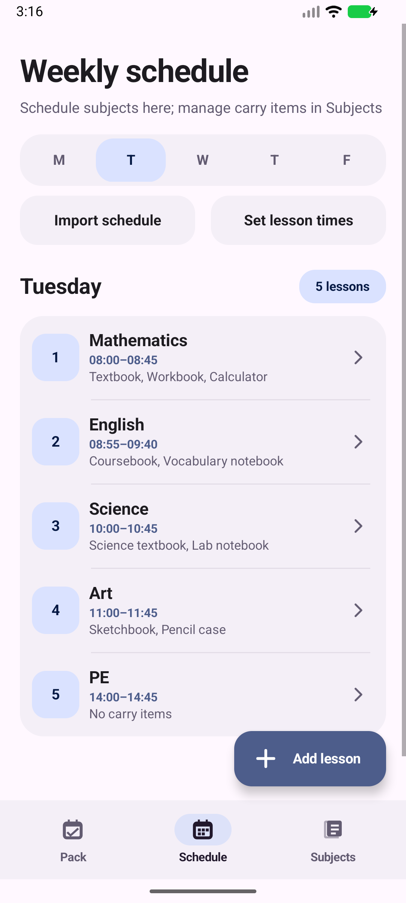
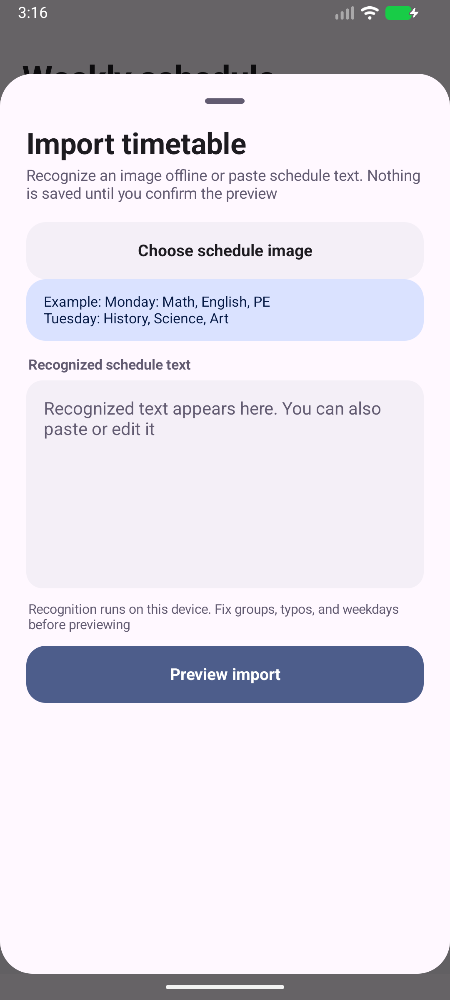
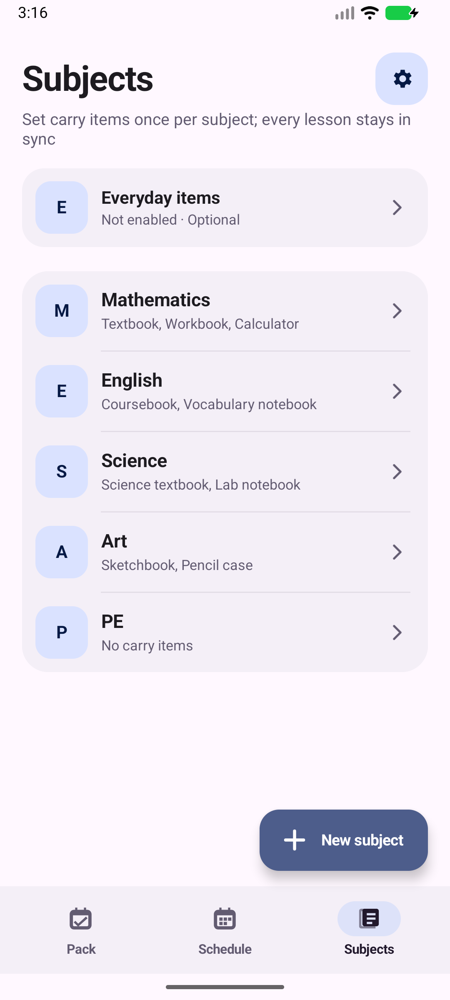

<p align="center">
  <strong>English</strong> · <a href="README.zh-CN.md">简体中文</a>
</p>

<p align="center">
  
</p>

<h1 align="center">CoursePack</h1>

<p align="center"><strong>Turn your timetable into a bag checklist you can tick item by item.</strong></p>
<p align="center">Native Android · Material 3 Expressive · Fully offline · No ads</p>
<p align="center"><strong>Built-in offline Chinese OCR · Timetable images never leave your device</strong></p>

CoursePack is a lightweight timetable and school-bag organizer. Set up each subject's textbooks, notebooks, assignments, and supplies once, place the subject in your weekly timetable, and the app automatically builds the checklist for the next school day.

There is no account, server, analytics SDK, or network permission. Timetable recognition, lessons, check states, and settings all stay on your device.

<p align="center">
  <a href="https://github.com/hejunlin1755/CoursePack">
    
  </a>
</p>

<p align="center">
  <strong>If CoursePack helps you, please consider starring the project.</strong><br />
  <sub>Animation generated with the MIT-licensed <a href="https://github.com/shinshin86/gh-star-gif">gh-star-gif</a>.</sub>
</p>

## Screenshots

<p align="center"><sub>Captured from the current Android build. Courses and carry items are demo data.</sub></p>

<p align="center">
  
  
  
  
</p>

## Features

- **Subject library:** Create a subject once and manage all of its carry items in one place.
- **Item-by-item checks:** Every book and supply has its own check state; a whole subject is never completed at once.
- **Persistent bag state:** Packed items remain packed across school days until you take them out.
- **Take-out list:** Items already in the bag but not needed for the current preparation day are shown separately.
- **Optional everyday items:** Add recurring or one-off items such as an ID card, bottle, or temporary form.
- **No-carry subjects:** Mark PE, homeroom, and similar subjects as requiring no items.
- **Smart preparation day:** Before noon, CoursePack prefers today; after noon, it moves to the next day with lessons and skips empty days.
- **Visual lesson-time picker:** Choose start and end times without typing a time format.
- **Bulk lesson times:** Select weekdays, first lesson time, lesson duration, break duration, and period count, then preview and apply.
- **Offline timetable recognition:** Choose an image and use the bundled Chinese OCR model entirely on-device.
- **Safe bulk import:** Edit recognized or pasted text, review a preview, and confirm before anything is written.
- **Home-screen widgets:** Dedicated compact 2×2 and large 4×2 layouts with live progress and unpacked-item summaries.
- **Live and background refresh:** Widgets update after edits, across day changes, after reboot, and after app upgrades.
- **Motion and haptics:** Directional transitions, item feedback, and a full-screen celebration when everything is packed.
- **Optional reminder:** Pick a time and receive a notification only when the bag is still unfinished.
- **English and Chinese UI:** Follow the system language or lock the app to Simplified Chinese or English.
- **Themes:** System, light, and dark modes with dynamic, violet, ocean, and forest accent palettes.
- **Local backup and restore:** Export or import lessons, items, checks, and settings through Android's system file picker.
- **Clean first run:** New installations contain no sample timetable or personal data.

## Workflow

```text
Create subjects and carry items → Add subjects to the timetable → Get a packing checklist → Pack or take out each item
```

## Import a timetable

On the **Schedule** tab, tap **Import schedule**. Choose a timetable image for offline recognition, or paste text copied from a table, chat, or another OCR app. The result remains editable and is not written until you approve the preview.

```text
Monday: Chinese, Mathematics, English, PE
Tuesday: History, Geography, Mathematics, Homeroom
Wednesday: English, Chinese, Science, Art
```

CoursePack uses OCR text positions together with weekday-column and lesson-row cues to reconstruct the table. It is not a keyword-only importer. Clear, front-facing images with complete weekday headers and period numbers work best; merged cells and grouped courses may still need manual correction.

`Empty`, `No class`, and `-` preserve a slot without creating a lesson. Existing lessons are skipped by default and are replaced only when you explicitly enable replacement in the preview.

If a timetable contains grouped labels such as `Eng 1/2/3/4` or `Math 1/2/3/4`, replace them with your own group before importing. CoursePack will not guess which group belongs to you.

## Home-screen widgets

| Size | Content |
| --- | --- |
| 2×2 | Preparation day, remaining count, segmented progress, and completion state |
| 4×2 | Full progress plus up to three items that still need to be packed |

On ColorOS, add a widget from:

```text
Long-press an empty area → Cards → All cards → Plugins → CoursePack
```

Some ColorOS versions do not allow third-party widgets to resize freely. Remove the widget and choose the other size when needed.

## Download

Download the latest APK from **[GitHub Releases](../../releases/latest)**.

Current source version: **2.9.3 (versionCode 34)**.

> The repository stores source code only. APKs belong in GitHub Releases, and signing keys must never be committed.

## Build from source

- JDK 17 or newer
- Android SDK 36
- Android Build Tools 36.x
- Android Gradle Plugin 8.10.1
- Android Studio, or a compatible Gradle environment

Open the repository root in Android Studio, wait for Gradle sync, and build the `app` module:

```text
Build → Build APK(s)
```

The project has no remote service or third-party account dependency and runs offline after compilation.

## Technical details

| Item | Value |
| --- | --- |
| Language | Java |
| UI | Native Android View |
| Minimum Android version | Android 8.0 / API 26 |
| Compile and target API | Android 36 |
| Storage | SharedPreferences, local device only |
| Network permission | None |
| APK size | About 44.84 MiB, including the bundled Chinese OCR model |

The APK is larger than earlier releases because the Chinese ML Kit text-recognition model is bundled for offline use, together with native recognition components for multiple phone architectures. The app itself remains a native Android View application with lightweight local storage.

## Permissions and privacy

| Permission | Purpose |
| --- | --- |
| `VIBRATE` | Tactile feedback for checking items and completing the bag |
| `POST_NOTIFICATIONS` | Requested only when the user enables the optional unfinished-bag reminder |
| `RECEIVE_BOOT_COMPLETED` | Restores cross-day widget updates after a reboot |

The manifest does not declare `INTERNET`. Subjects, timetables, carry items, and bag states stay on the device and are removed by Android when the app is uninstalled.

## Contributing

Issues and pull requests are welcome. When changing UI or behavior, please check light and dark themes, narrow screens, large system text, Android back gestures, reduced motion, both widget sizes, and refresh behavior across day changes and reboot.

Do not commit signing keys, personal timetables, device logs, ADB screenshots containing private data, or other personal information.

## License

Licensed under the [Apache License 2.0](LICENSE).

```text
SPDX-License-Identifier: Apache-2.0
```
