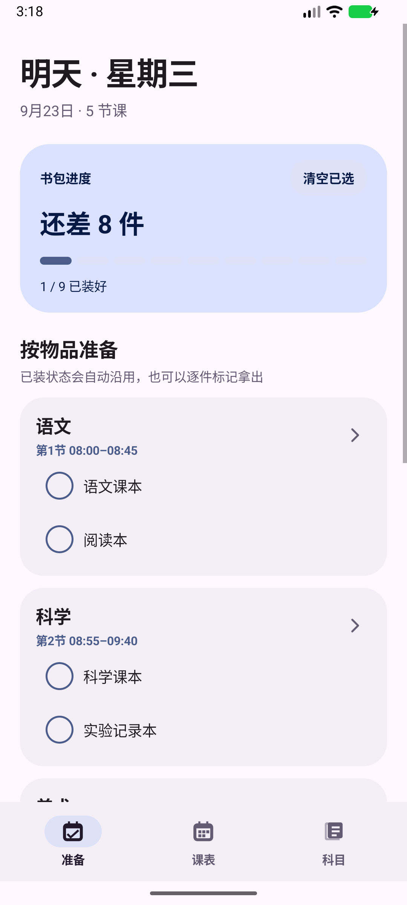
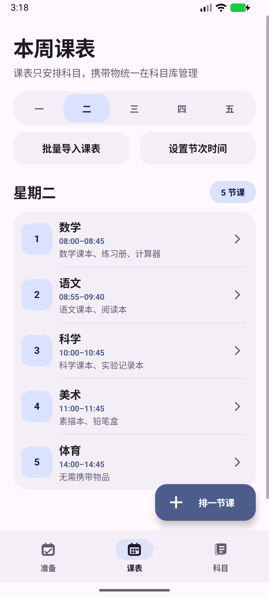
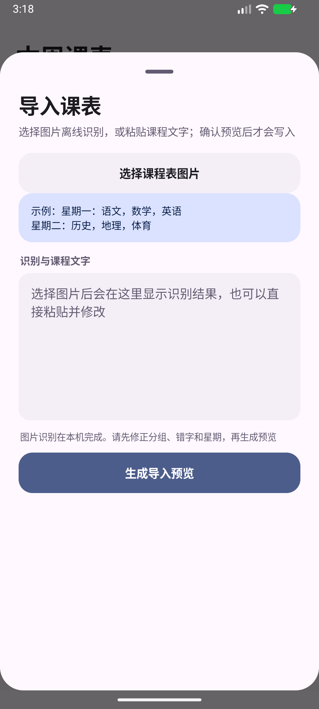
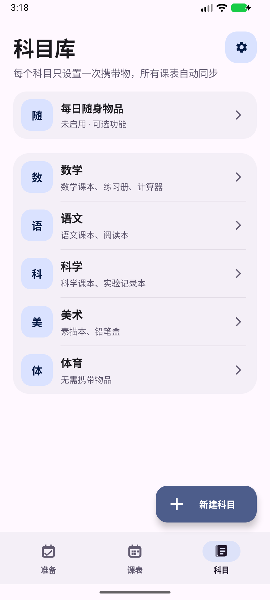

<p align="center">
  <a href="README.md">English</a> · <strong>简体中文</strong>
</p>

<p align="center">
  
</p>

<h1 align="center">课程包</h1>

<p align="center"><strong>把课程表变成真正能逐件勾选的书包清单。</strong></p>
<p align="center">原生 Android · Material 3 Expressive · 完全离线 · 无广告</p>
<p align="center"><strong>内置中文离线 OCR · 课程表图片无需上传</strong></p>

课程包是一款轻量的学生课程表与书包整理应用。每个科目的课本、笔记、作业和用品只需设置一次，排入课表后，应用会自动生成当前需要准备的清单。

它没有账号系统、没有服务器、没有分析 SDK，也没有申请网络权限。课程表图片在设备本机识别，课程、打卡和设置同样只保存在本机。

<p align="center">
  <a href="https://github.com/hejunlin1755/CoursePack">
    
  </a>
</p>

<p align="center">
  <strong>如果课程包帮到了你，欢迎点一下右上角 Star 支持这个开源项目。</strong><br />
  <sub>动图由 MIT 许可的 <a href="https://github.com/shinshin86/gh-star-gif">gh-star-gif</a> 生成。</sub>
</p>

## 截图

<p align="center"><sub>由当前 Android 版本实机渲染，课程与携带物为演示数据。</sub></p>

<p align="center">
  
  
  
  
</p>

## 功能

- **科目库**：先建立科目，再统一设置该科目需要携带的物品。
- **逐件勾选**：每一本书和每一件用品都有独立状态，不会整科一起完成。
- **书包状态沿用**：已经装入书包的物品会延续到之后的上课日，直到标记拿出。
- **拿出提醒**：自动列出已装好、但当前准备日不需要的物品。
- **每日随身**：可添加永久或临时物品；永久项每天重新打卡，临时项只出现一次。
- **无需携带**：体育、班务等科目可以明确标记为无需准备物品。
- **智能准备日**：上午优先显示今天，12:00 后切换到下一个有课日，并跳过周末和无课日。
- **点选课程时间**：使用 24 小时制面板选择开始和结束时间，无需输入格式。
- **批量生成节次**：选择多个星期、首节时间、每节时长、课间和节数，预览后批量应用。
- **图片识别课表**：直接选择课程表照片，使用内置中文模型在设备本机识别。
- **安全批量导入**：识别或粘贴的文字可以先修改，确认预览后才写入课表。
- **桌面小组件**：提供紧凑 2×2 与大号 4×2 两种独立布局。
- **即时与后台更新**：应用内修改后立即刷新，也会处理跨日、重启与升级。
- **动效与震动**：提供方向性过渡、逐项反馈和全部装好时的全屏完成动效。
- **可选书包提醒**：自行设置时间，只有清单尚未完成时才发送通知。
- **中英文界面**：可以跟随系统，也可以固定为简体中文或 English。
- **主题设置**：支持跟随系统、浅色、深色，以及动态色、紫罗兰、海洋蓝和森林绿。
- **备份与恢复**：通过 Android 系统文件选择器导出或导入课程、携带物、打卡与设置。
- **干净开始**：全新安装不附带示例课程或个人数据。

## 基本流程

```text
建立科目和携带物 → 把科目排入每周课表 → 自动生成准备清单 → 逐件装包或拿出
```

## 导入课程表

在“课表”页点击“批量导入课表”，可以选择课程表图片进行离线识别，也可以粘贴从表格、聊天或其他 OCR 应用复制的文字。识别结果可以修改，必须确认预览后才会写入。

```text
星期一：语文，数学，英语，体育
星期二：历史，地理，数学，班会
星期三：英语，语文，科学，美术
```

课程包不是只匹配关键字，而是结合 OCR 文字位置、星期列和节次行来尝试重建表格。拍照时尽量正对课表、避免反光，并保留完整的星期标题和节次编号；合并单元格或分组课程仍可能需要手动修正。

`空`、`无课`、`-` 会保留对应节次但不创建课程。已有课程默认安全跳过，只有手动开启替换后才会覆盖。

如果课表包含 `英1/英2/英3/英4`、`数1/数2/数3/数4` 等分组，请在导入前改成自己的组。应用不会猜测分组，避免导入他人的课程。

## 桌面小组件

| 规格 | 显示内容 |
| --- | --- |
| 2×2 | 当前准备日、剩余数量、分段进度和完成状态 |
| 4×2 | 完整进度，以及最多三件尚未装入的物品 |

ColorOS 用户可通过以下路径添加：

```text
长按桌面空白处 → 卡片 → 全部卡片 → 插件 → 课程包
```

部分 ColorOS 版本不允许第三方小组件自由缩放，需要移除后重新选择另一种规格。

## 下载 APK

请前往 **[GitHub Releases](../../releases/latest)** 下载最新 APK。

当前源码版本：**2.9.3（versionCode 34）**。

> 仓库只保存源码。APK 应作为 GitHub Release 附件发布，签名密钥不得提交到仓库。

## 从源码构建

- JDK 17 或更高版本
- Android SDK 36
- Android Build Tools 36.x
- Android Gradle Plugin 8.10.1
- Android Studio，或兼容版本的 Gradle

使用 Android Studio 打开仓库根目录，等待 Gradle 同步后构建 `app` 模块：

```text
Build → Build APK(s)
```

项目没有远程服务或第三方账号依赖，编译后即可离线运行。

## 技术信息

| 项目 | 内容 |
| --- | --- |
| 开发语言 | Java |
| UI | 原生 Android View |
| 最低系统 | Android 8.0 / API 26 |
| 编译及目标 API | Android 36 |
| 数据存储 | SharedPreferences，仅保存在本机 |
| 网络权限 | 无 |
| APK 体积 | 约 44.84 MiB，包含中文离线识别模型 |

安装包比早期版本更大，是因为从 2.8.0 起内置了 ML Kit 中文文字识别模型，以及多个手机架构需要的原生识别组件。应用本身仍使用原生 Android View 和轻量本地存储。

## 权限与隐私

| 权限 | 用途 |
| --- | --- |
| `VIBRATE` | 勾选与全部完成时提供触觉反馈 |
| `POST_NOTIFICATIONS` | 仅在用户主动开启书包提醒时申请 |
| `RECEIVE_BOOT_COMPLETED` | 重启后恢复小组件跨日更新 |

应用的 Manifest 没有声明 `INTERNET` 权限。科目、课表、携带物和书包状态都保存在本机；卸载应用时，Android 会一并删除这些数据。

## 参与贡献

欢迎提交 Issue 和 Pull Request。修改界面或功能时，请同时检查浅色与深色模式、窄屏、大字体、Android 返回手势、关闭动画后的静态反馈、两种小组件，以及跨日和重启后的刷新。

请勿提交签名密钥、个人课表、包含私人信息的设备日志或 ADB 截图。

## 许可证

本项目使用 [Apache License 2.0](LICENSE)。

```text
SPDX-License-Identifier: Apache-2.0
```
